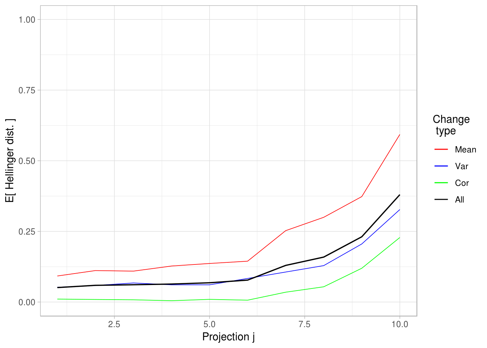
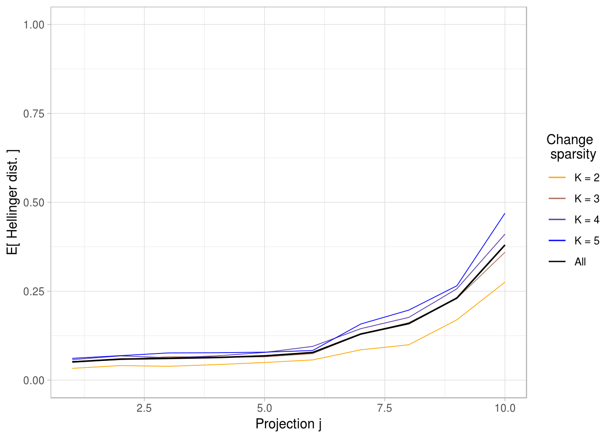
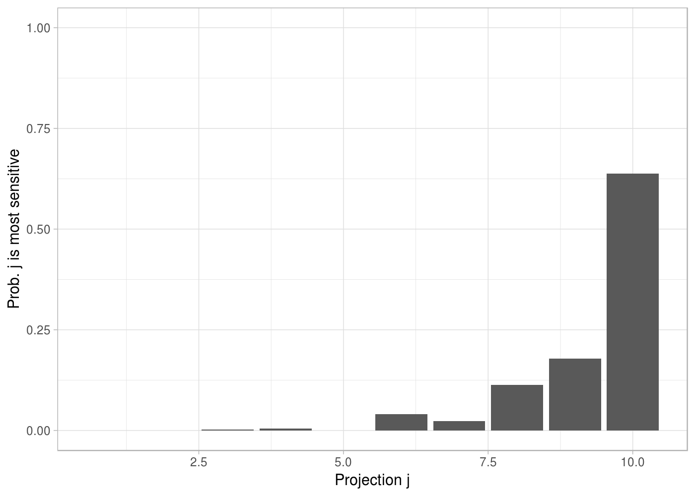

<!-- README.md is generated from README.Rmd. Please edit that file -->
tpca
====

An `R` package for automatically selecting which principal components to keep for detecting changes in the mean and/or covariance matrix. The choice of principal axes to project data onto is *tailored* to a normal state covariance matrix and a customizable distribution over relevant change scenarios. Functionality for both regular PCA and dynamic PCA exists.

Overview
--------

Functionality:

-   A function for tailoring PCA to a regular covariance matrix.
-   A function for tailoring PCA to a covariance matrix based on lagged observations, i.e., a dynamic PCA variant.
-   A generic function for setting up a uniform change distribution.
-   Functions for generating random correlation matrices, covariance matrices and correlation matrix estimates.
-   Summary and plot functions.

TPCA is designed to be used in for instance high-dimensional sensor network applications, where changes in the mean and/or covariance matrix indicates a system fault. TPCA helps reduce the dimension to those principal components that are most sensitive to the relevant changes. This both saves computation and can increase the precision or speed with which changes are detected.

Installation
------------

From inside `R`, use the following command:

``` r
# install.packages("devtools")
devtools::install_github("Tveten/tpca")
# library(tpca)
```

Usage
-----

``` r
library(tpca)
cor_mat <- rcor_mat(10)  # Generate random correlation matrix.
tpca_obj <- tpca(cor_mat, change_distr = 'semisparse_uniform', cutoff = 0.99)
ggplot_types(tpca_obj)
```



``` r
ggplot_sparsities(tpca_obj)
```



``` r
ggplot_prop(tpca_obj)
```



``` r
summary(tpca_obj)
#> Probability of projection j being the most sensitive (the projections are ordered decreasingly w.r.t variance): 
#>  j = 1  j = 2  j = 3  j = 4  j = 5  j = 6  j = 7  j = 8  j = 9 j = 10 
#>  0.000  0.000  0.002  0.005  0.000  0.040  0.023  0.113  0.179  0.638 
#> 
#> Chosen axes/projections in decreasing order of sensitivity: 
#> 10 9 8 6 7
```

Description
-----------

References
----------
